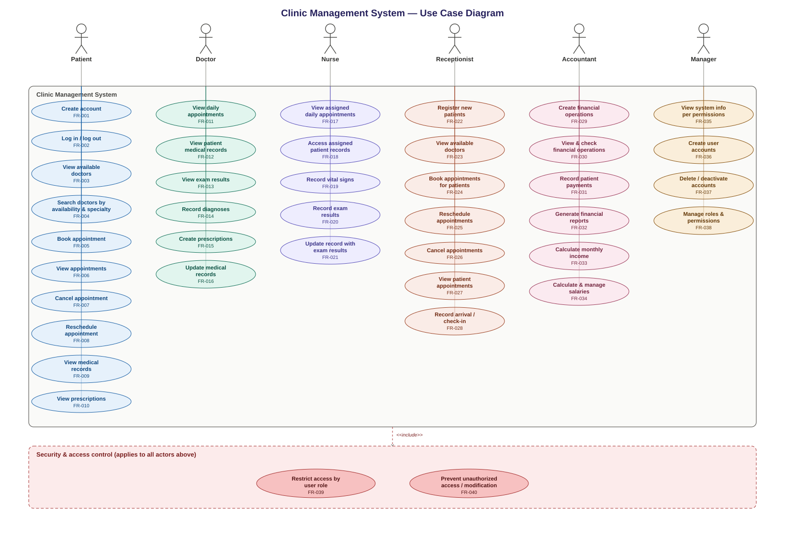
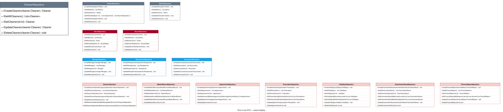

<div align="center">

# 🏥 Clinic API System

### A role-based ASP.NET Core Web API for managing clinic operations end-to-end

**Patients · Doctors · Nurses · Appointments · Prescriptions · Medical Records · Billing · Staff Management**

[](https://dotnet.microsoft.com/)
[](https://learn.microsoft.com/aspnet/core)
[](https://learn.microsoft.com/ef/core/)
[](https://www.microsoft.com/sql-server)
[](https://jwt.io/)
[](https://swagger.io/)

</div>

---

## 📚 Table of Contents

- [Overview](#-overview)
- [Tech Stack](#-tech-stack)
- [Architecture](#-architecture)
- [Roles & Authorization](#-roles--authorization)
- [Features](#-features)
- [Design & Documentation](#-design--documentation)
  - [Requirements Docs](#requirements-docs)
  - [Use Case Diagram](#use-case-diagram)
  - [CRC Cards](#crc-cards)
  - [Class Diagrams](#class-diagrams)
  - [Sequence Diagrams](#sequence-diagrams)
- [Project Structure](#-project-structure)
- [Getting Started](#-getting-started)
- [Configuration & Secrets](#-configuration--secrets)
- [API Documentation](#-api-documentation)
- [Roadmap](#-roadmap)
- [License](#-license)

---

## 🩺 Overview

Clinic API System is a backend service that models the day-to-day operations of a clinic: booking appointments, managing patients and staff (doctors, nurses, receptionists, accountants, managers, cleaners), recording medical history, prescriptions, vital signs, examination results, and handling payment operations and financial reporting.

The project was built to practice designing a real-world, multi-role system the right way: a clean layered architecture, a proper domain model, secure authentication, and full design documentation produced **before** writing code (use case diagrams, CRC cards, class diagrams, and sequence diagrams for every role).

> This is a learning / portfolio project — not yet dockerized or deployed. See [Roadmap](#-roadmap).

---

## 🧰 Tech Stack

| Layer | Technology |
|---|---|
| Framework | ASP.NET Core 9 Web API |
| ORM | Entity Framework Core 9 (Code-First + Migrations) |
| Database | SQL Server |
| Auth | ASP.NET Core Identity + JWT Bearer |
| Object Mapping | AutoMapper |
| API Docs | Swagger / OpenAPI |
| Language | C# |

---

## 🏗 Architecture

The project follows a classic layered architecture with a strict dependency direction:

```
Controllers  →  Services (IServices)  →  Repositories (IRepositories)  →  DbContext (EF Core)
```

- **Controllers** — handle HTTP concerns only (routing, model binding, status codes). No business logic.
- **Services** — own the business rules (e.g. preventing double-booked appointments, validating dates, generating JWTs).
- **Repositories** — the only layer that talks to `ClinicDbContext`, one repository per aggregate/entity.
- **DTOs + AutoMapper** — the API never exposes EF entities directly; every request/response goes through a DTO.
- **Domain models** — encapsulated with private setters and constructors (e.g. `Appointment`), so entities can only change state through explicit, validated methods like `Update()`.

User roles are modeled with table-per-hierarchy inheritance on top of ASP.NET Core Identity:

```
ApplicationUser (IdentityUser)
 ├── Patient
 └── Employee
      ├── Cleaner
      └── Graduated
           ├── MedicalStaff       → Doctor, Nurse
           └── NonMedicalStaff    → Receptionist, Accountant, Manager
 └── Admin
```

---

## 🔐 Roles & Authorization

Every endpoint is protected with `[Authorize(Roles = ...)]`, scoped to the roles that should legitimately access it (e.g. only Admin/Manager/Receptionist can manage staff records, only the Accountant/Manager/Admin can view payment operations).

| Role | Examples of what they can do |
|---|---|
| **Admin** | Full system access, manages all staff and configuration |
| **Manager** | Manages staff, oversees operations and reports |
| **Doctor** | Views appointments, writes prescriptions & medical records |
| **Nurse** | Records vital signs, assists with appointments |
| **Receptionist** | Books/manages appointments, registers patients |
| **Accountant** | Manages payment operations & financial reports |
| **Cleaner** | Limited access scoped to their own profile/schedule |
| **Patient** | Views their own appointments, prescriptions & records |

Authentication is done via **JWT Bearer tokens** issued at login (`/api/Auth/login`); the token carries the user's id and role claims, which `[Authorize(Roles = ...)]` checks on every protected request.

---

## ✨ Features

- 👤 **User & Staff Management** — CRUD for every role (Doctor, Nurse, Receptionist, Accountant, Manager, Cleaner, Patient, Admin)
- 📅 **Appointment Management** — booking, rescheduling, cancellation, conflict detection, filtering by status/doctor/nurse/patient
- 💊 **Prescriptions** — created by doctors, linked to patients and medical records
- 📋 **Medical Records & Examination Results** — full patient medical history tracking
- 💉 **Vital Signs** — recorded per appointment/patient
- 💳 **Payment Operations & Financial Reports** — billing and clinic financial tracking
- 🔐 **Secure Auth** — ASP.NET Core Identity + JWT, role-based authorization on every endpoint
- ⚠️ **Global Exception Handling** — consistent `ProblemDetails` error responses across the API
- 📖 **Swagger/OpenAPI** — interactive API documentation out of the box

---

## 📐 Design & Documentation

Before writing any code, this project went through a full design phase. All diagrams below live in [`clinicAPIsSystem/Docs`](clinicAPIsSystem/Docs) and are rendered here directly from the repo.

### Requirements Docs

- [Problem Statement](clinicAPIsSystem/Docs/Requirements/Problem%20statement.md)
- [Project Overview](clinicAPIsSystem/Docs/Requirements/ProjectOverview.md)
- [Goals & Objectives](clinicAPIsSystem/Docs/Requirements/Goals%20.md)
- [Functional Requirements](clinicAPIsSystem/Docs/Requirements/FunctionalRequirements.md)
- [Stakeholders](clinicAPIsSystem/Docs/Requirements/StackHoldels.md)

### Use Case Diagram



### CRC Cards


### Class Diagrams

| Diagram | Preview |
|---|---|
| Models (Domain Entities) |  |
| Repository Layer (`IRepository`) |  |
| Service Layer (`IService`) |  |
| DTOs |  |

### Sequence Diagrams

**Core workflows**

| Appointment | Prescription | Medical Record |
|---|---|---|
|  |  |  |

| Examination Result | Vital Signs | Payment Operation | Financial Report |
|---|---|---|---|
|  |  |  |  |

**Per-role service flows**

<details>
<summary>Click to expand all role-based sequence diagrams</summary>

| Role | Diagram |
|---|---|
| Admin |  |
| Doctor |  |
| Nurse |  |
| Manager |  |
| Receptionist |  |
| Accountant |  |
| Cleaner |  |
| Patient |  |

</details>

---

## 📁 Project Structure

```
clinicAPIsSystem/
├── Controllers/          # HTTP endpoints, grouped by domain (Auth, User roles, Appointment, ...)
├── Services/              # Business logic implementation
├── IServices/              # Service contracts
├── Repositories/          # Data access implementation
├── IRepositories/          # Repository contracts
├── Models/                # Domain entities (encapsulated, EF Core Code-First)
├── DTOs/                  # Request/response contracts per feature
├── Mapping/                # AutoMapper profiles
├── Data/                  # DbContext + EF Core entity configurations + Seeders
├── Exceptions/             # Global exception handler
├── Migrations/             # EF Core migrations history
└── Docs/                  # Requirements docs + UML/design diagrams
```

---

## 🚀 Getting Started

### Prerequisites

- [.NET 9 SDK](https://dotnet.microsoft.com/download)
- SQL Server (LocalDB is fine for local development)

### Steps

```bash
# 1. Clone the repo
git clone https://github.com/<your-username>/clinicAPIsSystem.git
cd clinicAPIsSystem/clinicAPIsSystem

# 2. Restore dependencies
dotnet restore

# 3. Set your JWT secret (see Configuration & Secrets below)
dotnet user-secrets init
dotnet user-secrets set "JWT:Key" "your-own-strong-secret-key"

# 4. Apply EF Core migrations
dotnet ef database update

# 5. Run the API
dotnet run
```

The API will be available at the URL shown in the console, with Swagger UI at `/swagger` in Development mode.

---

## ⚙️ Configuration & Secrets

`appsettings.json` holds non-sensitive defaults only. Sensitive values (JWT signing key, connection strings for real environments) are **not committed to source control**:

- **Local development** → managed with [.NET User Secrets](https://learn.microsoft.com/aspnet/core/security/app-secrets) (`dotnet user-secrets`), stored outside the project folder.
- **Production** → should be provided via environment variables or a secrets manager (e.g. Azure Key Vault), never via `appsettings.json`.

Required configuration keys:

```json
{
  "ConnectionStrings": {
    "DefaultConnection": "..."
  },
  "JWT": {
    "Key": "...",
    "Issuer": "ClinicAPI",
    "Audience": "ClinicAPIUsers",
    "ExpireMinutes": 60
  }
}
```

---

## 📖 API Documentation

Once running in Development mode, full interactive API documentation is available via **Swagger UI** at:

```
/swagger
```

Every endpoint is documented with its expected request/response schema and required role.

---

## 🛣 Roadmap

- [ ] Unit & integration tests
- [ ] Dockerize the API + SQL Server for one-command local setup
- [ ] CI/CD pipeline
- [ ] Cloud deployment
- [ ] Pagination on list endpoints

---

## 📄 License

See [LICENSE](LICENSE) for details.

---

<div align="center">

If this project helped you, consider giving it a ⭐

</div>
