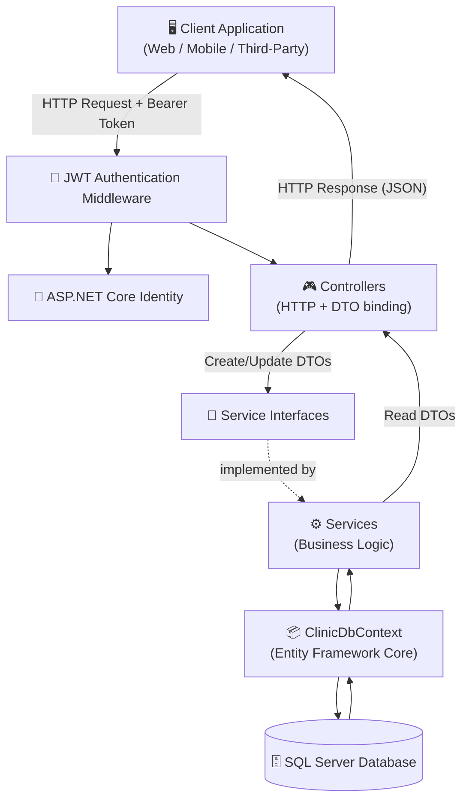
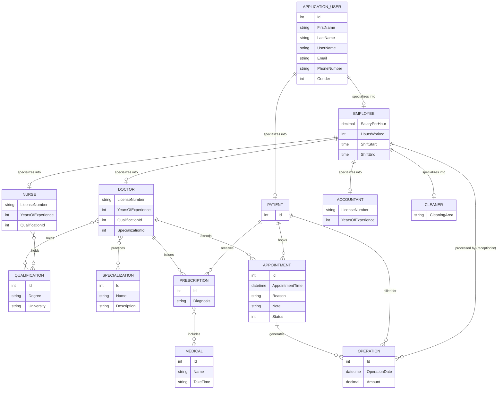
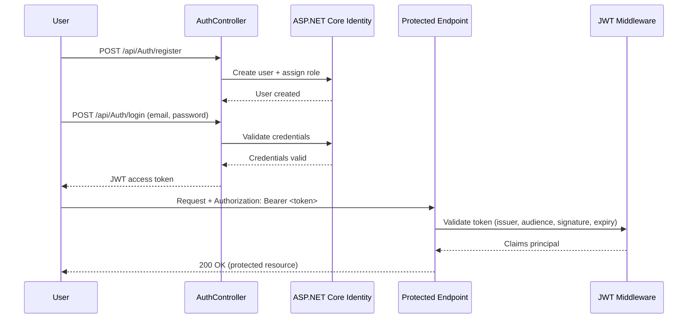

<div align="center">

# 🏥 Clinic APIs System

### A modular, role-driven backend for running the day-to-day operations of a clinic

**Patients · Doctors · Nurses · Appointments · Prescriptions · Operations · Staff Administration**

Built with ASP.NET Core, secured with JWT, backed by SQL Server, documented with Swagger.

<br/>

[](https://dotnet.microsoft.com/)
[](https://learn.microsoft.com/aspnet/core)
[](https://learn.microsoft.com/ef/core/)
[](https://www.microsoft.com/sql-server)
[](https://swagger.io/)
[](https://jwt.io/)
[](#-license)

</div>

<br/>

> [!NOTE]
> This README documents only what exists in the project's source, folder structure, and OpenAPI (Swagger) specification. Where a detail (such as an exact role name or an authorization policy) could not be confirmed from those sources, it is explicitly called out rather than guessed.

---

## 📚 Table of Contents

- [Overview](#-overview)
- [Architecture](#-architecture)
- [Database Design](#-database-design)
- [Authentication & Authorization](#-authentication--authorization)
- [Features](#-features)
- [API Documentation](#-api-documentation)
- [Project Structure](#-project-structure)
- [Getting Started](#-getting-started)
- [Configuration](#-configuration)
- [Design Decisions](#-design-decisions)
- [Data Models (Selected)](#-data-models-selected)
- [Dependency Injection](#-dependency-injection)
- [Future Improvements](#-future-improvements)
- [Screenshots](#-screenshots)
- [Project Highlights](#-project-highlights)
- [License](#-license)
- [Contributing](#-contributing)

---

## 🩺 Overview

**Clinic APIs System** is a backend API for managing the operational workflow of a clinic — from patient intake and staff onboarding to scheduling appointments, recording operations, and issuing prescriptions.

### Why this project exists

Small and mid-sized clinics typically juggle multiple, disconnected tools: a spreadsheet for staff shifts, a separate scheduling app, and paper-based prescriptions. This project consolidates those workflows behind a single, consistent, role-aware API that a front-end (web, mobile, or desktop) can be built against.

### The problem it solves

The API centralizes the core entities a clinic needs to operate:

- **Who works there** — doctors, nurses, accountants, cleaners, receptionists, and admins — each with role-specific attributes (e.g., a doctor's specialization, a cleaner's assigned area).
- **Who is treated** — patients, with their own identity and history.
- **What happens** — appointments, operations, and prescriptions, all linked back to the people involved.

### Who would use it

- Clinic/hospital software teams needing a ready-made staff and patient management backend.
- Front-end or mobile developers who need a documented, JWT-secured API to build a clinic dashboard against.
- Students or engineers studying a layered ASP.NET Core Web API architecture (Controller → Service → Interface → EF Core → SQL Server) applied to a real-world, multi-role domain.

### Why ASP.NET Core Identity + JWT

- **ASP.NET Core Identity** provides battle-tested user management out of the box: password hashing, validation rules, role management, and a data store that integrates natively with Entity Framework Core — avoiding the need to hand-roll authentication primitives.
- **JWT Bearer authentication** is a natural fit for an API-first, front-end-agnostic backend: tokens are stateless, self-contained, and work equally well for a web SPA, a mobile app, or a third-party integration, without requiring server-side session storage.

Together, Identity handles *who a user is* (registration, credentials, roles) while JWT handles *proving it* on every subsequent request.

---

## 🏗 Architecture

The application follows a classic **layered Web API architecture**:

| Layer | Responsibility |
|---|---|
| **Controllers** | Handle HTTP requests/responses, model binding, and route DTOs in and out. One controller per domain area (e.g., `AppointmentController`, `AuthController`), with user-related controllers additionally grouped under `Controllers/UserController`. |
| **Interfaces** | Define service contracts (e.g., `IAppointmentService`, `IDoctorService`) that controllers depend on — enabling loose coupling and testability. |
| **Services** | Implement the interfaces and contain the business logic (validation, orchestration, mapping between entities and DTOs). |
| **DTOs (`ClinicDTOs`)** | Shape the data crossing the API boundary — `Create*`, `Update*`, and read DTOs — so internal EF Core entities are never exposed directly. |
| **Entity Framework Core** | Provides the `ClinicDbContext`, entity configurations (Fluent API, under `Data/ClinicConfiguration`), and migrations for persistence. |
| **SQL Server** | The relational data store the API is built against (`Microsoft.EntityFrameworkCore.SqlServer`). |
| **Authentication** | ASP.NET Core Identity + JWT Bearer, configured in `Program.cs`. |
| **Dependency Injection** | Every service and its interface is registered in the built-in ASP.NET Core DI container in `Program.cs`, along with the `RoleSeeder` and `AdminSeeder`. |

### Request Flow



### Dependency Injection at a Glance

Controllers never instantiate services directly — they receive an interface via constructor injection, and the concrete implementation is resolved by the DI container (registered with `AddScoped` in `Program.cs`). See [Dependency Injection](#-dependency-injection) for the full registration list.

---

## 🗃 Database Design

> [!IMPORTANT]
> The diagram below is reconstructed from the DTO field shapes exposed in the OpenAPI specification and the project's folder/namespace structure (e.g., `Models/User/MedicalStaff`, `Models/User/NonMedicalStaff`). It has **not** been verified against the entity classes or `ClinicDbContext` source directly, so treat the inheritance hierarchy and cardinalities as a best-effort reconstruction rather than a confirmed schema.

### Key Entities

- **ApplicationUser** — the ASP.NET Core Identity base user (`firstName`, `lastName`, `userName`, `email`, `phoneNumber`, `gender`, `password`). Every person-type DTO (`CreatePatientDto`, `CreateEmployeeDto`, `CreateDoctorDto`, etc.) carries this exact same base field set, which strongly suggests `Patient` and `Employee` derive from it.
- **Patient** — a person receiving care; the subject of appointments, prescriptions, and operations.
- **Employee** — extends the base user with `salaryPerHour`, `hoursWorked`, `shiftStart`, `shiftEnd`. Created either as a **receptionist** or an **admin** via `POST /api/Employee/receptionists` and `POST /api/Employee/admins`.
- **Doctor / Nurse** (Medical Staff) — extend `Employee` with `licenseNumber`, `yearsOfExperience`, and a `qualificationId`. `Doctor` additionally requires a `specializationId`.
- **Accountant / Cleaner** (Non-Medical Staff) — extend `Employee`. `Accountant` adds `licenseNumber` and `yearsOfExperience`; `Cleaner` adds `cleaningArea`.
- **Appointment** — links a `Doctor` and a `Patient`, with `appointmentTime`, `reason`, an optional `note`, and a `status` (enum).
- **Operation** — links a `Patient`, an `Appointment`, and the `receptionist` (Employee) who processed it, with an `operationDate` and `amount`.
- **Prescription** — links a `Doctor` and a `Patient`, carries a `diagnosis`, and has a many-to-many relationship with **Medical** (medications) — exposed via the `/api/Prescription/{prescriptionId}/medications/{medicalId}` endpoints.
- **Medical** — a medication, with a `name` and `takeTime`.
- **Qualification** — a `degree` + `university`, linked to medical staff (many-to-many, via `/api/Qualification/{qualificationId}/medical-staff/{medicalStaffId}`).
- **Specialization** — a `name` + `description`, linked to doctors (many-to-many, via `/api/Specialization/{specializationId}/doctors/{doctorId}`).

### Entity-Relationship Diagram



---

## 🔐 Authentication & Authorization

### ASP.NET Core Identity

The project uses `AddIdentity<ApplicationUser, IdentityRole<int>>` for user and role management, backed by `ClinicDbContext` via `AddEntityFrameworkStores`. Password rules are enforced at configuration time:

| Rule | Value |
|---|---|
| Requires digit | ✅ |
| Requires lowercase | ✅ |
| Requires uppercase | ✅ |
| Requires non-alphanumeric | ❌ |
| Minimum length | 8 |
| Unique email required | ✅ |

### JWT Bearer Authentication

Once a user is authenticated (`POST /api/Auth/login`), the API issues a JWT. Every subsequent request presents it as a `Bearer` token, and the middleware validates it against the configured `JWT:Issuer`, `JWT:Audience`, and `JWT:Key`:

- ✅ Issuer validated
- ✅ Audience validated
- ✅ Lifetime validated
- ✅ Signing key validated (HMAC-SHA via `SymmetricSecurityKey`)
- ⏱️ Clock skew tolerance is set to **zero** (no default 5-minute grace period)

### Authentication Flow



### Roles

The application seeds roles at startup via `RoleSeeder` and creates an initial administrator via `AdminSeeder` (both run in `Program.cs` before the app starts serving requests). Based on the distinct person-types exposed across the API (`Doctor`, `Nurse`, `Accountant`, `Cleaner`, `Patient`, and `Employee` sub-types `receptionists`/`admins`), the following roles are implied by the domain model:

| Role | Created via |
|---|---|
| **Admin** | `POST /api/Employee/admins` |
| **Receptionist** | `POST /api/Employee/receptionists` |
| **Doctor** | `POST /api/Doctor` |
| **Nurse** | `POST /api/Nurse` |
| **Accountant** | `POST /api/Accountant/create` |
| **Cleaner** | `POST /api/Cleaner/create` |
| **Patient** | `POST /api/Patient/CreatePatient` |

> [!WARNING]
> The exact string values seeded by `RoleSeeder`, and which roles are authorized to call which endpoints, are not declared in the OpenAPI specification (no `security` requirements are present on any operation) and were not visible in the provided source files. The table above reflects the person-types the API can create — treat it as a reasonable inference, not a confirmed authorization matrix.

---

## ✨ Features

### 👤 User Management
- User registration and login (`AuthController`) via ASP.NET Core Identity
- JWT issuance and validation for stateless authentication
- Role-based user model (Admin, Receptionist, Doctor, Nurse, Accountant, Cleaner, Patient)
- Self-service profile management — view, update, and delete your own account (`/api/ApplicationUser/me`)
- Lookup users by ID, username, or email
- Centralized user administration (`UserAdministrationController`) — list, view, update, delete users, and promote a user to admin

### 📅 Appointment Management
- Create, update, and (soft) delete appointments
- Query appointments by ID, by doctor, by patient, by patient + doctor pair, or by status

### 🧑‍⚕️ Staff Management
- Onboard doctors and nurses, each linked to a qualification (and doctors additionally to a specialization)
- Onboard accountants and cleaners, each with role-specific attributes (license/experience, cleaning area)
- Onboard receptionists and admins as employee sub-types
- Query staff by salary, hours worked, or shift start time (employees); by license (accountants); by specialization (doctors)

### 💊 Prescription Management
- Create, retrieve, update, and delete prescriptions
- Attach and remove individual medications on a prescription
- Query prescriptions by patient, by doctor, or by medication

### 💉 Medical (Medication) Management
- Add, list, retrieve, update, and delete medication records

### 🩹 Operation Management
- Record operations linked to an appointment, patient, and processing receptionist
- Query operations by ID, by patient, by receptionist, or by appointment

### 🎓 Qualification & Specialization Management
- CRUD for qualifications and specializations
- Assign qualifications to medical staff and list a qualification's staff
- Assign specializations to doctors and list a specialization's doctors

### 🌐 Platform & Infrastructure
- Swagger / OpenAPI documentation (Development environment)
- Configurable CORS policy for front-end integration
- Automatic role and admin seeding on startup
- Clean separation of concerns via Controller → Interface → Service → EF Core layering

---

## 📖 API Documentation

All routes are prefixed with `/api`. Endpoints are organized below by business domain rather than by controller class.

<details>
<summary><strong>🔑 Authentication APIs</strong></summary>

| Method | Endpoint | Description |
|---|---|---|
| `POST` | `/api/Auth/login` | Authenticate a user and receive a JWT |
| `POST` | `/api/Auth/register` | Register a new user |

</details>

<details>
<summary><strong>👤 User & Administration APIs</strong></summary>

**Application User (self-service)**

| Method | Endpoint | Description |
|---|---|---|
| `GET` | `/api/ApplicationUser/{id}` | Get a user by ID |
| `GET` | `/api/ApplicationUser/by-username/{userName}` | Get a user by username |
| `GET` | `/api/ApplicationUser/by-email/{email}` | Get a user by email |
| `PUT` | `/api/ApplicationUser/me` | Update the current user's own profile |
| `DELETE` | `/api/ApplicationUser/me` | Delete the current user's own account |

**User Administration**

| Method | Endpoint | Description |
|---|---|---|
| `PATCH` | `/api/UserAdministration/{userId}/assign-admin` | Promote a user to admin |
| `GET` | `/api/UserAdministration` | List all users |
| `GET` | `/api/UserAdministration/{id}` | Get a user by ID |
| `GET` | `/api/UserAdministration/by-username/{userName}` | Get a user by username |
| `GET` | `/api/UserAdministration/by-email/{email}` | Get a user by email |
| `PUT` | `/api/UserAdministration/{userId}` | Update a user |
| `DELETE` | `/api/UserAdministration/{userId}` | Delete a user |

</details>

<details>
<summary><strong>🧑‍⚕️ Staff & Employee APIs</strong></summary>

**Patients**

| Method | Endpoint | Description |
|---|---|---|
| `POST` | `/api/Patient/CreatePatient` | Register a new patient |

**Employees (Receptionists & Admins)**

| Method | Endpoint | Description |
|---|---|---|
| `POST` | `/api/Employee/receptionists` | Create a receptionist |
| `POST` | `/api/Employee/admins` | Create an admin |
| `GET` | `/api/Employee/by-salary/{salary}` | Query employees by salary |
| `GET` | `/api/Employee/by-hours-worked/{hoursWorked}` | Query employees by hours worked |
| `GET` | `/api/Employee/by-shift-start/{shiftStart}` | Query employees by shift start time |

**Doctors**

| Method | Endpoint | Description |
|---|---|---|
| `POST` | `/api/Doctor` | Create a doctor |
| `GET` | `/api/Doctor/by-specialization` | Query doctors by specialization |
| `PUT` | `/api/Doctor/{id}` | Update a doctor |

**Nurses**

| Method | Endpoint | Description |
|---|---|---|
| `POST` | `/api/Nurse` | Create a nurse |
| `PUT` | `/api/Nurse` | Update a nurse |

**Accountants**

| Method | Endpoint | Description |
|---|---|---|
| `POST` | `/api/Accountant/create` | Create an accountant |
| `GET` | `/api/Accountant/get-by-license` | Query accountants by license |
| `PUT` | `/api/Accountant/update/{id}` | Update an accountant |

**Cleaners**

| Method | Endpoint | Description |
|---|---|---|
| `POST` | `/api/Cleaner/create` | Create a cleaner |
| `GET` | `/api/Cleaner/get/{id}` | Get a cleaner by ID |
| `GET` | `/api/Cleaner/get/{CleaningArea}` | Query cleaners by cleaning area |
| `POST` | `/api/Cleaner/Update/{id}` | Update a cleaner |
| `DELETE` | `/api/Cleaner/delete/{id}` | Delete a cleaner |

</details>

<details>
<summary><strong>📅 Appointment APIs</strong></summary>

| Method | Endpoint | Description |
|---|---|---|
| `POST` | `/api/Appointment/create` | Create an appointment |
| `GET` | `/api/Appointment/get-all` | List all appointments |
| `GET` | `/api/Appointment/get-by-id/{id}` | Get an appointment by ID |
| `GET` | `/api/Appointment/get-by-doctor-id/{doctorId}` | Get appointments for a doctor |
| `GET` | `/api/Appointment/get-by-patient-id/{id}` | Get appointments for a patient (by route ID) |
| `GET` | `/api/Appointment/get-by-patient-id` | Get appointments for the current patient |
| `GET` | `/api/Appointment/get-by-patient-and-doctor/{patientId}/{doctorId}` | Get appointments for a patient/doctor pair |
| `GET` | `/api/Appointment/get-by-status/{status}` | Get appointments by status |
| `PUT` | `/api/Appointment/update/{id}` | Update an appointment |
| `PUT` | `/api/Appointment/delete-appointment/{appointmentId}` | Cancel/delete an appointment |

</details>

<details>
<summary><strong>🩹 Operation APIs</strong></summary>

| Method | Endpoint | Description |
|---|---|---|
| `POST` | `/api/Operation` | Record an operation |
| `GET` | `/api/Operation/all` | List all operations |
| `GET` | `/api/Operation/by-id/{id}` | Get an operation by ID |
| `GET` | `/api/Operation/by-patint-id/{id}` | Get operations for a patient |
| `GET` | `/api/Operation/by-receptionist-id/{id}` | Get operations processed by a receptionist |
| `GET` | `/api/Operation/by-appointment-id/{id}` | Get the operation for an appointment |

</details>

<details>
<summary><strong>💊 Prescription APIs</strong></summary>

| Method | Endpoint | Description |
|---|---|---|
| `POST` | `/api/Prescription` | Create a prescription |
| `GET` | `/api/Prescription` | List prescriptions |
| `GET` | `/api/Prescription/{id}` | Get a prescription by ID |
| `PUT` | `/api/Prescription/{prescriptionId}` | Update a prescription |
| `DELETE` | `/api/Prescription/{id}` | Delete a prescription |
| `POST` | `/api/Prescription/{prescriptionId}/medications/{medicalId}` | Attach a medication to a prescription |
| `DELETE` | `/api/Prescription/{prescriptionId}/medications/{medicalId}` | Remove a medication from a prescription |
| `GET` | `/api/Prescription/patient/{patientId}` | Get prescriptions for a patient |
| `GET` | `/api/Prescription/doctor/{doctorId}` | Get prescriptions written by a doctor |
| `GET` | `/api/Prescription/medical/{medicalId}` | Get prescriptions containing a medication |

</details>

<details>
<summary><strong>💉 Medical (Medication) APIs</strong></summary>

| Method | Endpoint | Description |
|---|---|---|
| `POST` | `/api/Medical/Add` | Add a medication |
| `GET` | `/api/Medical/get-all` | List medications |
| `GET` | `/api/Medical/get-by-id/{id}` | Get a medication by ID |
| `PUT` | `/api/Medical/update/{id}` | Update a medication |
| `DELETE` | `/api/Medical/delete` | Delete a medication |

</details>

<details>
<summary><strong>🎓 Qualification & Specialization APIs</strong></summary>

**Qualification**

| Method | Endpoint | Description |
|---|---|---|
| `POST` | `/api/Qualification` | Create a qualification |
| `GET` | `/api/Qualification` | List qualifications |
| `GET` | `/api/Qualification/{id}` | Get a qualification by ID |
| `PUT` | `/api/Qualification/{qualificationId}` | Update a qualification |
| `DELETE` | `/api/Qualification/{id}` | Delete a qualification |
| `POST` | `/api/Qualification/{qualificationId}/medical-staff/{medicalStaffId}` | Assign a qualification to a medical staff member |
| `GET` | `/api/Qualification/{qualificationId}/medical-staff` | List staff holding a qualification |

**Specialization**

| Method | Endpoint | Description |
|---|---|---|
| `POST` | `/api/Specialization` | Create a specialization |
| `GET` | `/api/Specialization` | List specializations |
| `GET` | `/api/Specialization/{id}` | Get a specialization by ID |
| `PUT` | `/api/Specialization/{id}` | Update a specialization |
| `DELETE` | `/api/Specialization/{id}` | Delete a specialization |
| `POST` | `/api/Specialization/{specializationId}/doctors/{doctorId}` | Assign a specialization to a doctor |
| `GET` | `/api/Specialization/{specializationId}/doctors` | List doctors with a specialization |

</details>

---

## 📁 Project Structure

```
clinicAPIsSystem/
├── ClinicDTOs/                     # Request/response contracts — never expose EF entities directly
│   ├── AppointmentDTOs/
│   ├── AuthDTOs/
│   ├── MedicalDTOs/
│   ├── OperationDTOs/
│   ├── PrescriptionDTOs/
│   ├── QualificationDTOs/
│   ├── SpecializationDTOs/
│   └── UserDTOs/
│       ├── ApplicationUserDTOs/
│       ├── EmployeeDTOs/
│       ├── MedicalStaffDTOs/        # Doctor, Nurse
│       └── NonMedicalStaffDTOs/     # Accountant, Cleaner
│
├── Controllers/                    # HTTP entry points, one per domain area
│   ├── AppointmentController.cs
│   ├── AuthController.cs
│   ├── MedicalController.cs
│   ├── OperationController.cs
│   ├── PrescriptionController.cs
│   ├── QualificationController.cs
│   ├── SpecializationController.cs
│   └── UserController/             # People-related controllers, grouped together
│       ├── ApplicationUserController.cs
│       ├── EmployeeController.cs
│       ├── PatientController.cs
│       ├── UserAdministrationController.cs
│       ├── IMedicalController/          # Doctor, Nurse
│       └── NonMedicalStaffController/   # Accountant, Cleaner
│
├── Data/                           # Persistence layer
│   ├── ClinicDbContext.cs          # EF Core DbContext
│   ├── ClinicConfiguration/        # Fluent API entity configurations
│   │   └── UserConfiguration/
│   │       ├── MedicalStaffConfiguration/
│   │       └── NonMedicalStaffConfi/
│   └── Seeder/                     # Startup data seeding
│       ├── AdminSeeder.cs
│       └── RoleSeeder.cs
│
├── Interfaces/                     # Service contracts consumed by controllers
│   └── IUserService/
│       ├── IMedicalStaffService/
│       └── INonMedicalStaffService/
│
├── Migrations/                     # EF Core migration history
│
├── Models/                         # Domain entities
│   ├── Appointment.cs
│   ├── Enums.cs                    # Gender, AppointmentStatus, etc.
│   ├── Medical.cs
│   ├── Operation.cs
│   ├── Prescription.cs
│   ├── Qualification.cs
│   ├── Specialization.cs
│   └── User/
│       ├── ApplicationUser.cs      # Identity base user
│       ├── Employee.cs
│       ├── Patient.cs
│       ├── MedicalStaff/           # Doctor, Nurse
│       └── NonMedicalStaff/        # Accountant, Cleaner
│
├── Services/                       # Business logic implementing the Interfaces
│   └── UserService/
│       ├── MedicalStaffService/
│       └── NonMedicalStaffService/
│
├── Properties/
│   └── launchSettings.json
│
├── Program.cs                      # Composition root: DI, Identity, JWT, CORS, Swagger, seeding
├── appsettings.json
└── appsettings.Development.json
```

**Why this layout?** Each top-level folder maps to a single architectural concern (routing, contracts, business logic, persistence, domain), and nested folders mirror the domain's natural grouping — medical vs. non-medical staff, user-related vs. clinical controllers — so a new contributor can predict where a given class lives without searching.

---

## 🚀 Getting Started

### Prerequisites

- [.NET 9 SDK](https://dotnet.microsoft.com/download)
- SQL Server (local or remote instance)

### Steps

1. **Clone the repository** and navigate to the project directory.
2. **Restore dependencies:**
   ```bash
   dotnet restore
   ```
3. **Configure** the connection string and JWT settings (see [Configuration](#-configuration) below).
4. **Apply database migrations** (the project already includes migrations under `Migrations/`):
   ```bash
   dotnet ef database update
   ```
5. **Run the application:**
   ```bash
   dotnet run
   ```
6. On startup, the app automatically seeds roles and an admin account via `RoleSeeder` and `AdminSeeder`.
7. In the Development environment, the Swagger UI and OpenAPI document are available for exploring the API interactively.

---

## ⚙️ Configuration

Configure the following in `appsettings.json` (or `appsettings.Development.json` / environment variables):

### Connection String

```json
{
  "ConnectionStrings": {
    "DefaultConnection": "<your SQL Server connection string>"
  }
}
```

### JWT Settings

```json
{
  "JWT": {
    "Key": "<your secret signing key>",
    "Issuer": "<your issuer>",
    "Audience": "<your audience>"
  }
}
```

> [!IMPORTANT]
> The application throws a startup exception if `JWT:Key` is missing — this value is required.

### CORS

```json
{
  "Cors": {
    "AllowedOrigins": [ "http://localhost:3000" ]
  }
}
```

If not set, the API defaults to allowing `http://localhost:3000`.

---

## 🧠 Design Decisions

| Pattern | Why it was used |
|---|---|
| **Service Layer** | Keeps controllers thin — controllers only handle HTTP concerns, while services own validation and business rules. This makes the logic reusable and testable independent of the web framework. |
| **DTO Pattern** | Decouples the public API contract from the internal EF Core entity model. `Create*`/`Update*` DTOs allow different validation rules per operation (e.g., `UpdateApplicationUserDto` doesn't require a password) without leaking persistence details or over-posting risk. |
| **Dependency Injection** | Every service is registered against its interface (`AddScoped`), letting `Program.cs` act as a single composition root and making each service swappable/mockable in isolation. |
| **ASP.NET Core Identity** | Provides production-grade user/credential/role management (hashing, lockouts, uniqueness checks) instead of reimplementing authentication primitives. |
| **Fluent API / Entity Configurations** | Entity shape and constraints (keys, relationships, required fields) are defined explicitly in dedicated `*Configuration` classes under `Data/ClinicConfiguration`, keeping `ClinicDbContext` itself clean and each entity's mapping easy to locate and review independently. |

---

## 📊 Data Models (Selected)

Examples of request payloads defined in the API's OpenAPI schema (see the full spec for the complete set of DTOs):

- **LoginDto:** `email` (string, required), `password` (string, required)
- **CreatePatientDto:** `firstName`, `lastName`, `userName`, `email`, `phoneNumber`, `gender` (enum), `password` — all required
- **CreateAppointmentDto:** `doctorId` (int), `patientId` (int), `appointmentTime` (date-time), `reason` (string), `note` (optional string)
- **CreateDoctorDto:** `firstName`, `lastName`, `userName`, `email`, `phoneNumber`, `gender`, `password`, `salaryPerHour`, `hoursWorked`, `shiftStart`, `shiftEnd`, `yearsOfExperience`, `licenseNumber`, `qualificationId`, `specializationId` — all required
- **CreateOperationDto:** `receptionistId`, `patientId`, `appointmentId`, `operationDate`, `amount` — all required
- **CreatePresciptionDto:** `diagnosis`, `doctorId`, `patientId` — all required
- **CreateMedicalDto:** `name`, `takeTime` — both required
- **CreateQualificationDto:** `degree`, `university` — both required
- **CreateSpecializationDto:** `name`, `description` — both required
- **Gender:** integer enum (`0`, `1`)
- **AppointmentStatus:** integer enum (`0`–`3`)

> The specific meaning of each enum value is not documented in the OpenAPI schema and isn't included here to avoid guessing.

---

## 🧩 Dependency Injection

The following services are registered in `Program.cs`:

| Interface | Implementation |
|---|---|
| `IApplicationUserService` | `ApplicationUserService` |
| `IEmployeeService` | `EmployeeService` |
| `IPatientService` | `PatientService` |
| `IDoctorService` | `DoctorService` |
| `INurseServices` | `NurseService` |
| `IAccountantService` | `AccountantService` |
| `ICleanerService` | `CleanerService` |
| `IAppointmentService` | `AppointmentService` |
| `IAuthServices` | `AuthService` |
| `IMedicalService` | `MedicalService` |
| `IOperationService` | `OperationService` |
| `IPrescriptionService` | `PrescriptionService` |
| `IQualificationService` | `QualificationService` |
| `ISpecializationService` | `SpecializationService` |
| — | `RoleSeeder` |
| — | `AdminSeeder` |

---

## 🛣 Future Improvements

> [!NOTE]
> This is a proposed roadmap of common production-readiness enhancements — none of the items below are currently implemented; they are not part of the existing feature set.

- [ ] **Refresh Tokens** — extend JWT auth with long-lived refresh tokens for silent re-authentication
- [ ] **Docker** — containerize the API and SQL Server for one-command local setup
- [ ] **Unit Testing** — test coverage for the service layer
- [ ] **Integration Testing** — end-to-end coverage for controllers and the database
- [ ] **Structured Logging** — request/response and diagnostic logging (e.g., Serilog)
- [ ] **Email Verification** — confirm patient/staff emails on registration
- [ ] **Redis Caching** — cache frequently-read, rarely-changed lookups (qualifications, specializations)
- [ ] **CQRS** — separate read and write paths for complex reporting queries
- [ ] **Clean Architecture** — further decouple domain logic from infrastructure concerns
- [ ] **CI/CD Pipeline** — automated build, test, and deployment workflow

---

## 🌟 Project Highlights

- **Domain-rich modeling** — staff aren't a single generic "User" type; each role (Doctor, Nurse, Accountant, Cleaner, Receptionist, Admin) carries its own meaningful attributes.
- **Consistent layering** — every domain area follows the same Controller → Interface → Service → EF Core path, making the codebase predictable to navigate.
- **DTO-first API surface** — internal entities are never exposed directly; every endpoint has purpose-built `Create`/`Update`/read contracts.
- **Security-first startup** — the app refuses to start without a JWT signing key configured, avoiding accidental deployment with insecure defaults.
- **Self-documenting** — Swagger/OpenAPI is wired in out of the box for interactive exploration and client generation.
- **Sensible defaults, explicit overrides** — CORS, connection strings, and JWT settings are all externalized to configuration rather than hardcoded.

## 🤝 Contributing

Contributions are welcome! To propose a change:

1. **Fork** the repository and create your branch from `main`:
   ```bash
   git checkout -b feature/your-feature-name
   ```
2. **Follow the existing architecture** — new functionality should go through the Controller → Interface → Service pattern, with DTOs for any new request/response shapes.
3. **Add or update EF Core migrations** if your change affects the data model:
   ```bash
   dotnet ef migrations add YourMigrationName
   ```
4. **Build and verify** the project compiles cleanly:
   ```bash
   dotnet build
   ```
5. **Commit** with a clear, descriptive message and **open a Pull Request**, describing what changed and why.

Please keep pull requests focused — smaller, single-purpose PRs are easier to review and merge.

---

<div align="center">

### If this project helped you, consider giving it a ⭐

**Built with ASP.NET Core · Documented for developers, by developers**

</div>
